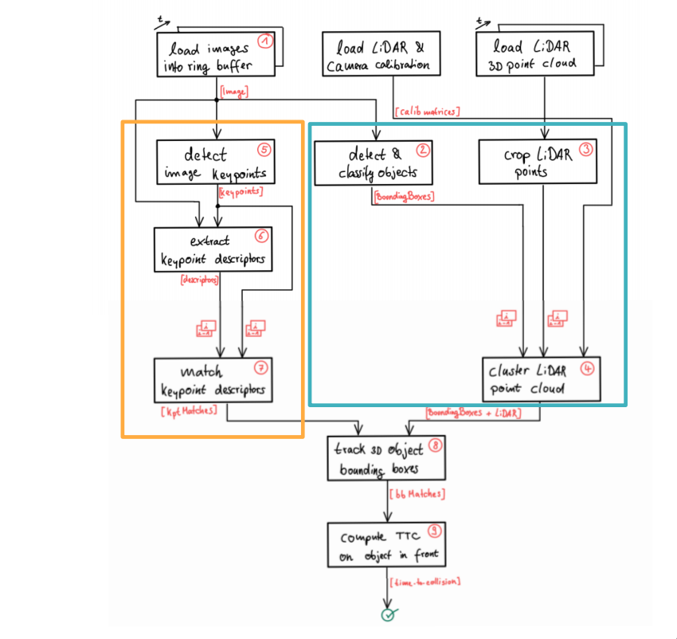
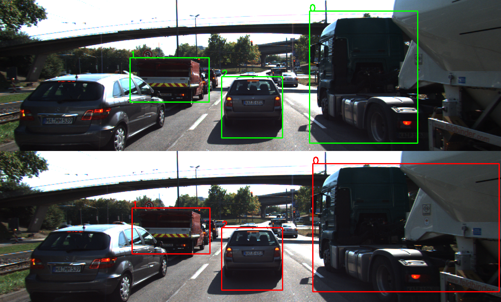

# 3D Object Tracking

## Overview
In this project the following keys concepts were developed:
* Keypoint detectors and descriptors
* Object detection using the pre-trained YOLO deep-learning framework
* Methods to track objects by matching keypoints and bounding boxes across successive images
* Associating regions in a camera image with lidar points in 3D space
* Estimate TTC (aka Time-To-Collision) using LiDAR and camera key point matching 

## Dependencies for Running Locally
* cmake >= 2.8
  * All OSes: [click here for installation instructions](https://cmake.org/install/)
* make >= 4.1 (Linux, Mac), 3.81 (Windows)
  * Linux: make is installed by default on most Linux distros
  * Mac: [install Xcode command line tools to get make](https://developer.apple.com/xcode/features/)
  * Windows: [Click here for installation instructions](http://gnuwin32.sourceforge.net/packages/make.htm)
* Git LFS
  * Weight files are handled using [LFS](https://git-lfs.github.com/)
* OpenCV >= 4.1
  * This must be compiled from source using the `-D OPENCV_ENABLE_NONFREE=ON` cmake flag for testing the SIFT and SURF detectors.
  * The OpenCV 4.1.0 source code can be found [here](https://github.com/opencv/opencv/tree/4.1.0)
* gcc/g++ >= 5.4
  * Linux: gcc / g++ is installed by default on most Linux distros
  * Mac: same deal as make - [install Xcode command line tools](https://developer.apple.com/xcode/features/)
  * Windows: recommend using [MinGW](http://www.mingw.org/)

## Basic Build Instructions

1. Clone this repo.
2. Make a build directory in the top level project directory: `mkdir build && cd build`
3. Compile: `cmake .. && make`
4. Run it: `./3D_object_tracking arg1 arg2 arg3 arg4 arg5`.

For each argument, we select the following options:

* arg1(KeyPoints Type): HARRIS, FAST, BRISK, ORB, AKAZE, and SIFT
* arg2(Descriptors Type): BRIEF, ORB, FREAK, AKAZE, SIFT
* arg3 (matcher Type) : MAT_BF, MAT_FLANN
* arg4 (descriptor Type) : DES_BINARY, DES_HOG
* arg5 (selector Type):  SEL_NN, SEL_KNN

## Implementation approach  

### Match 3D Objects

The algorithm performing match of bounding boxes is in [matchBoundingBoxes](src/camera_fusion.cpp).
The implementation is divided into three seteps: 
1. Store in a pair of values box ids which are in previous and current frame bounding boxes
2. Evaluate the number of pair points per bounding box match between current and previous frame
3. Find the highest number of points per bounding box in prev and current frame above a certain threshold, choosing only the max counting bounding box per object detected 

### Compute Lidar-based TTC
The algorithm to [compute lidar TTC](src/camera_fusion.cpp) is divided into three parts: 
1. Outliers removal.
2. Compute closest point in previous and current lidar frame. 
3. Compute TTC between both frames.

The outliers removal is based on defined threshold euclidean distance around each point belonging to a cluster (in our case cars). 

### Associate Keypoint Correspondences with Bounding Boxes
The algorithm is implemented in [clusterKptMatchesWithROI](src/camFusion.hpp). 
The match between keypoints and each bounding box is divided into two steps:
1. Compute absolute mean distance between current and previous frames, considering only the keypoints belonging to a bounding box.
2. Store the keypoints within a certain distance threshold.

## Reference

* For further details on analytics about TTC estimates check [this report](writeup.md)

## Disclamer
This project was cloned from [Udacity 3D tracking project](https://github.com/udacity/SFND_3D_Object_Tracking) in the context of [Sensor Fusion Engineer nanodegree](https://www.udacity.com/course/sensor-fusion-engineer-nanodegree--nd313).
