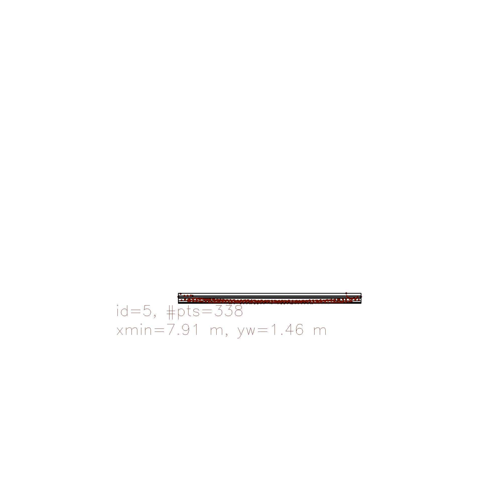

# Results report 

## Match 3D Objects

The algorithm performing match of bounding boxes is in $matchBoundingBoxes$ ($camera_fusion.cpp$).
The implementation is divided into three seteps: 
1. Store in a pair of values box ids which are in previous and current frame bounding boxes
2. Evaluate the number of pair points per bounding box match between current and previous frame
3. Find the highest number of points per bounding box in prev and current frame above a certain threshold, choosing only the max counting bounding box per object detected 

## Compute Lidar-based TTC
The algorithm to compute lidar TTC is divided into three parts ($computeTTCLidar$ method in $camera_fusion.cpp$) : 
1. Outliers removal.
2. Compute closest point in previous and current lidar frame. 
3. Compute TTC between both frames.

The outliers removal is based on defined threshold euclidean distance around each point belonging to a cluster (in our case cars). 

## Associate Keypoint Correspondences with Bounding Boxes

The match between keypoints and each bounding box is divided into two steps:
1. Compute absolute mean distance between current and previous frames, considering only the keypoints belonging to a bounding box.
2. Store the keypoints within a certain distance threshold.

## Compute Camera-based TTC
The algorithm is in $computeTTCCamera$ ($camerafusion.cpp$)

1. Compute distance ratio between all matched keypoints 
2. Compute median of distance ratios in order to make the algorithm more robust to ouliers
3. Compute TTC using previous result

## Performance Evaluation 1: Lidar TTC evaluation  
In order to evaluate the Lidar TTC evaluation, let's discuss the following use cases (detector type/descriptor type/ TTC):
* FAST-FREAK: inf s
* FAST-BRIEF: 16.96 s 
* ORB-BRIEF: 16.96 s  

One of the reasons it may lead to off Lidar TTC is not enough outlier robustness that causes an overestimate of TTC.
Another potential reason is the using only x-axis direction to compute distance between measurements. Finally, another reason is underpeformance in clustering objects due to limitations of point cloud projection leading to occlusion parts of the object.

## Performance Evaluation 2: Lidar and Camera TTC difference evaluation 

## Reference
* Check [results](results/data.csv) for Lidar and Camera TTC for differents combinations of keypoints descriptor and detectors.