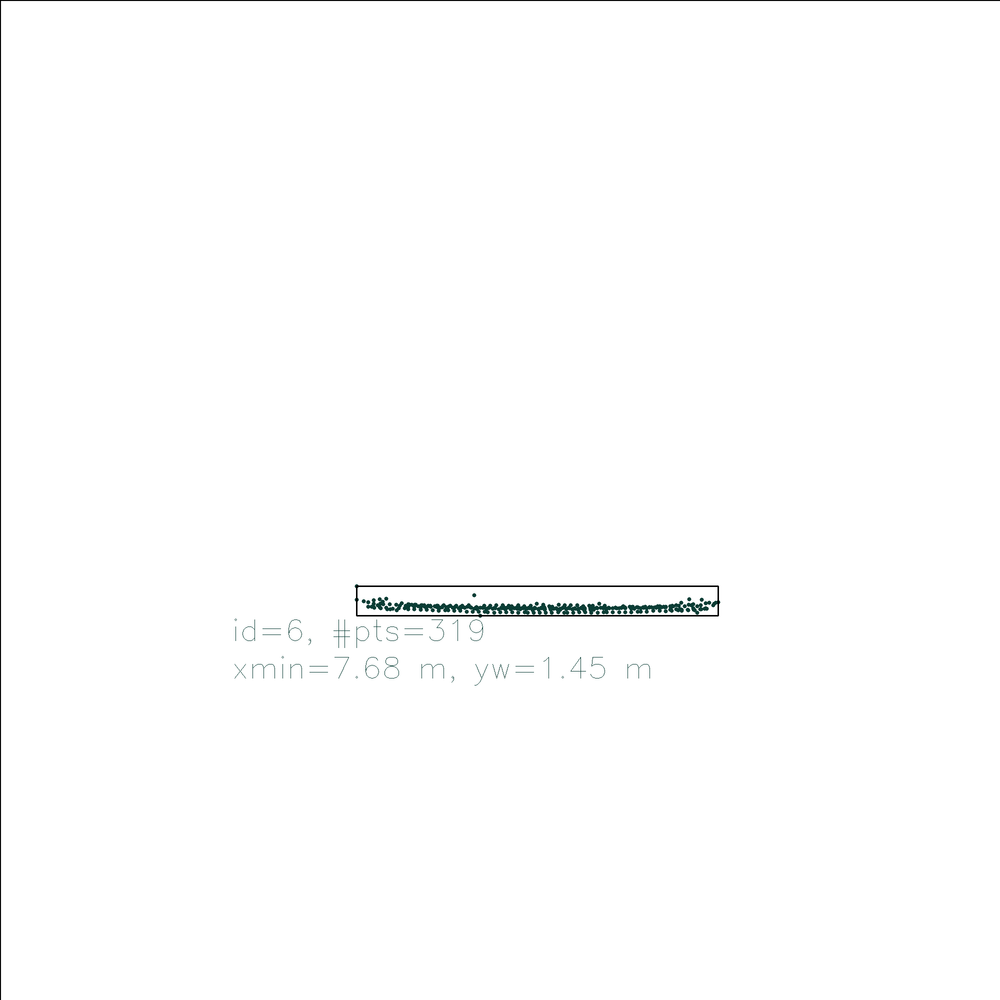
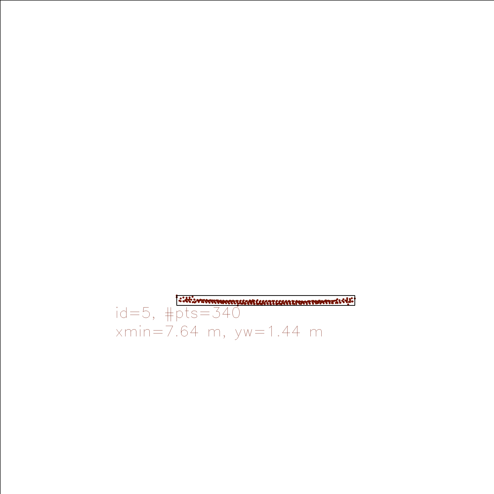
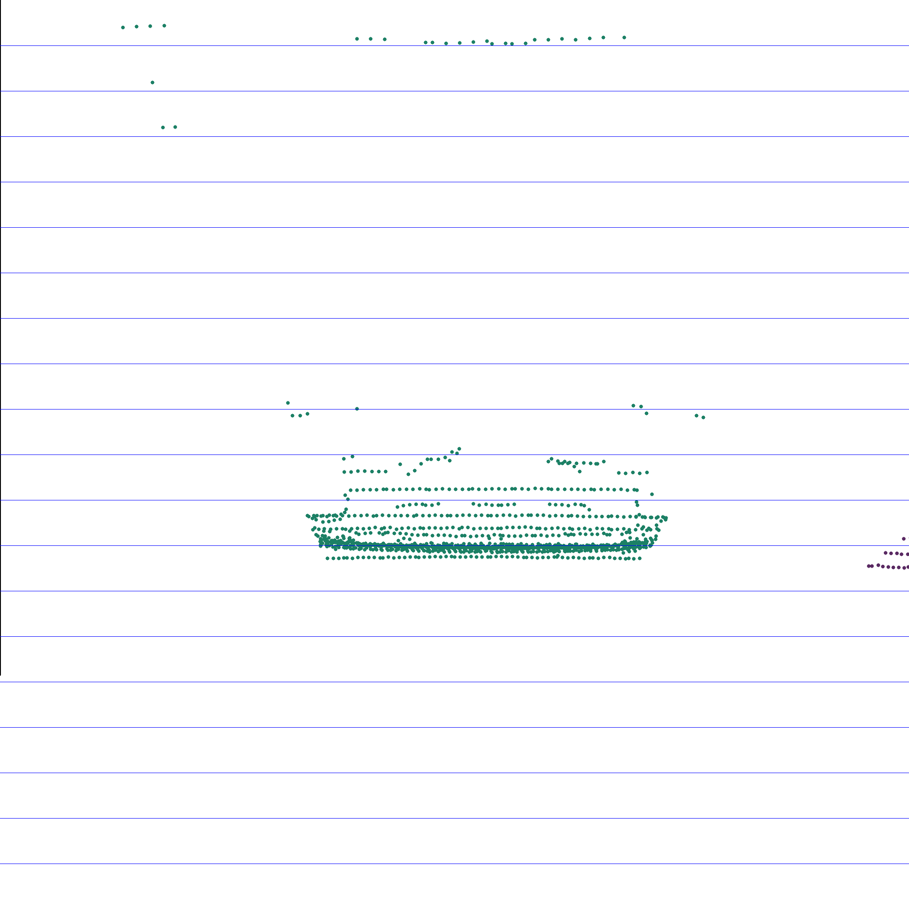
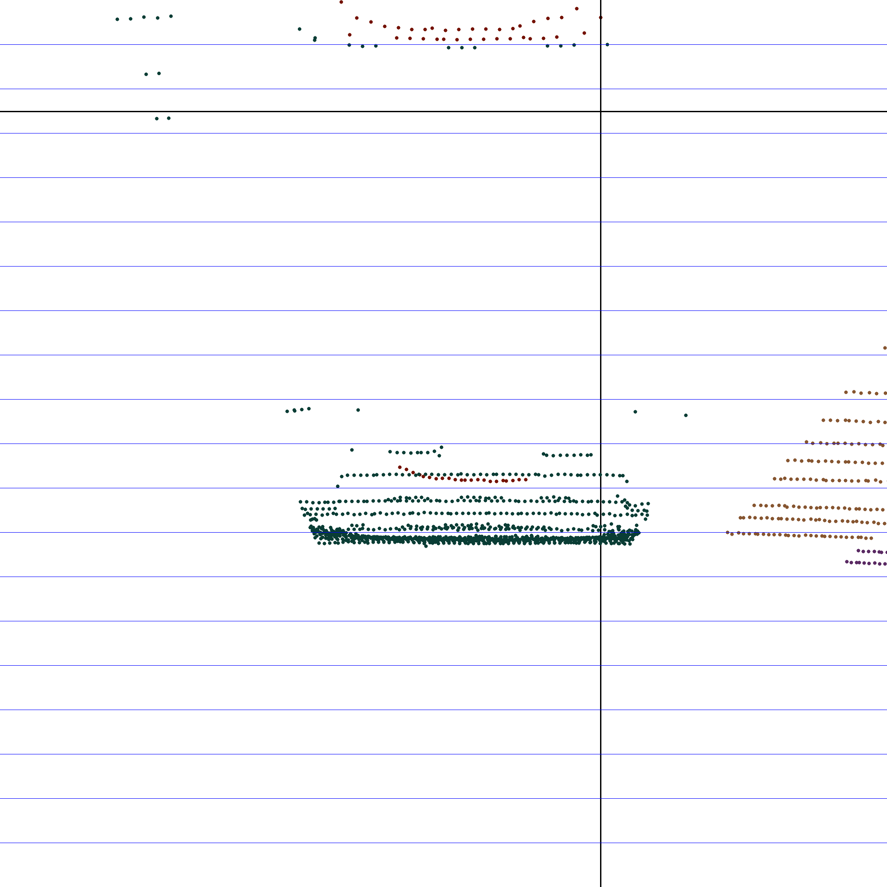
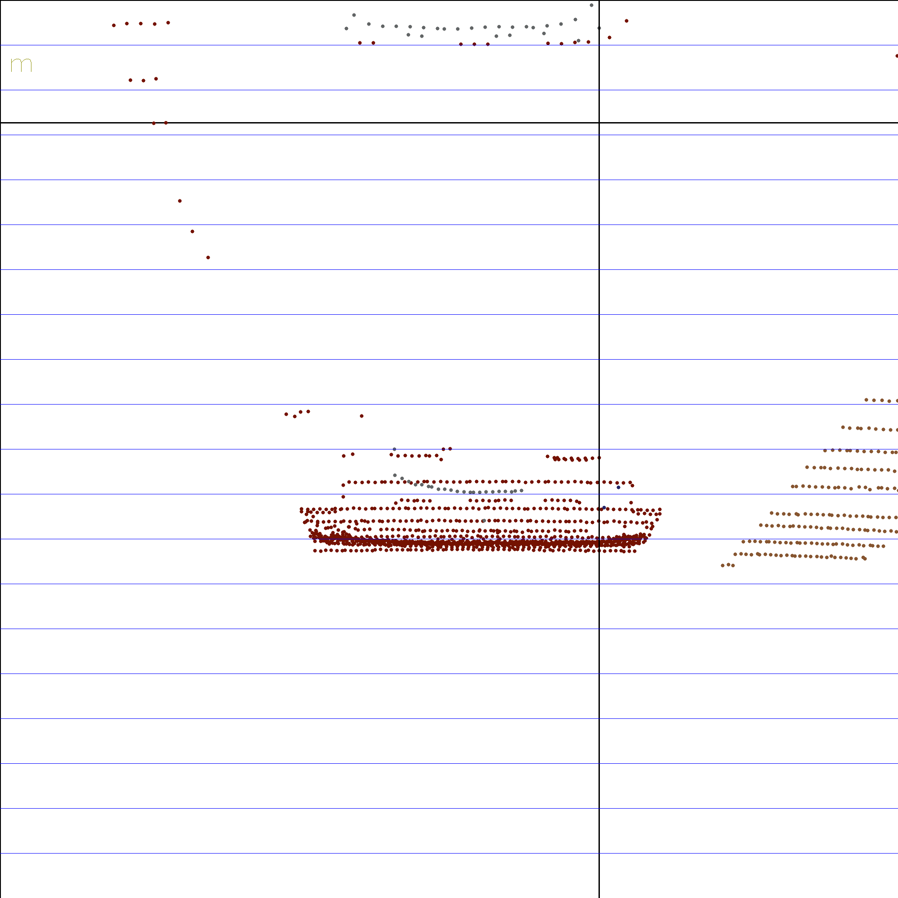
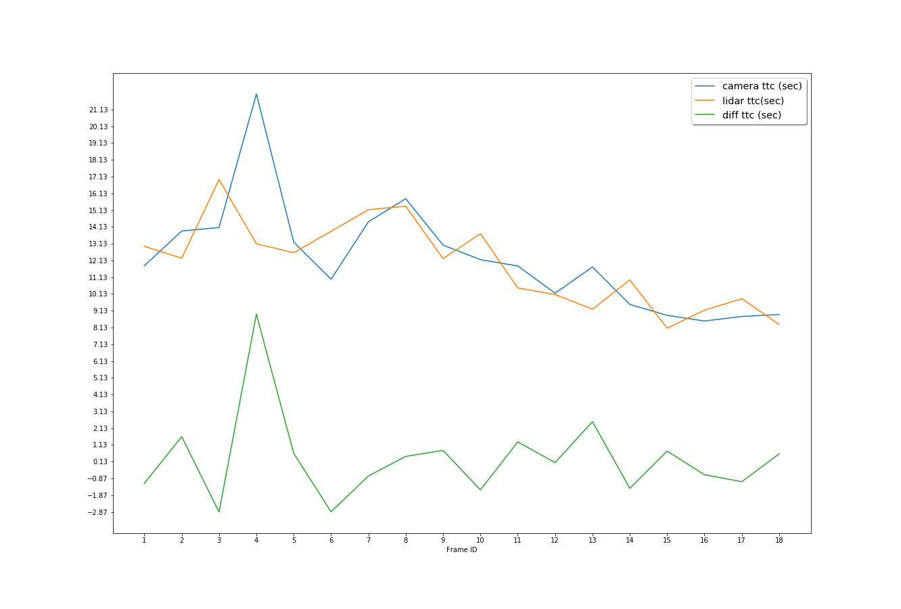
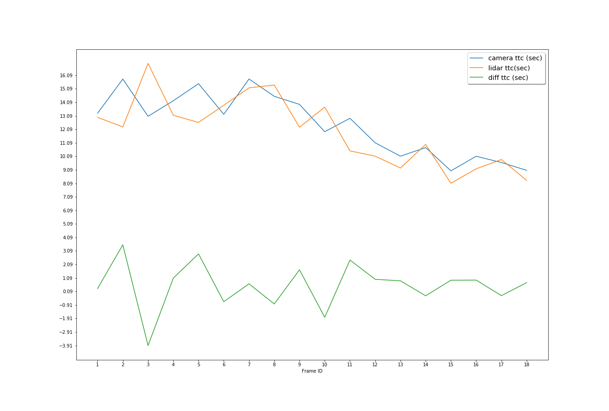
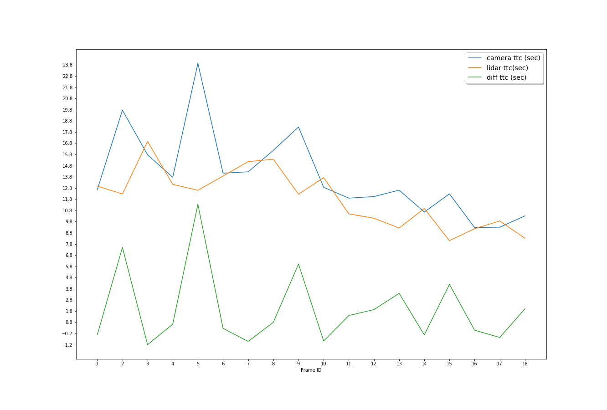
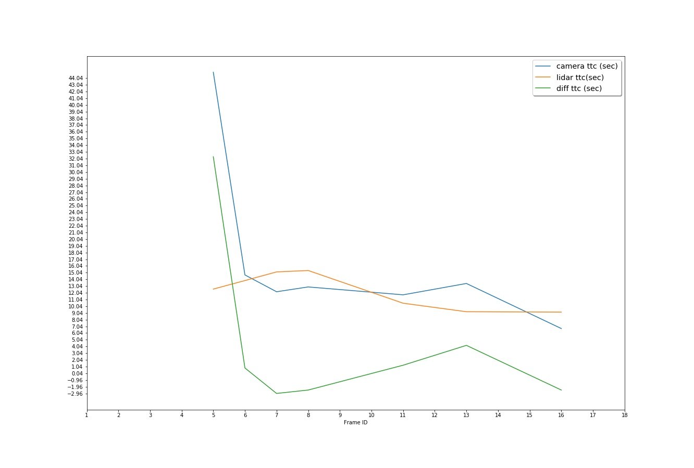

# Results report 

## Match 3D Objects

The algorithm performing match of bounding boxes is in **matchBoundingBoxes** (**camera_fusion.cpp**).
The implementation is divided into three seteps: 
1. Store in a pair of values box ids which are in previous and current frame bounding boxes
2. Evaluate the number of pair points per bounding box match between current and previous frame
3. Find the highest number of points per bounding box in prev and current frame above a certain threshold, choosing only the max counting bounding box per object detected 

## Compute Lidar-based TTC
The algorithm to compute lidar TTC is divided into three parts (**computeTTCLidar** method in **camera_fusion.cpp**) : 
1. Outliers removal.
2. Compute closest point in previous and current lidar frame. 
3. Compute TTC between both frames.

The outliers removal is based on defined threshold euclidean distance around each point belonging to a cluster (in our case cars). 

## Associate Keypoint Correspondences with Bounding Boxes
The algorithm is implemented in **clusterKptMatchesWithROI**. 
The match between keypoints and each bounding box is divided into two steps:
1. Compute absolute mean distance between current and previous frames, considering only the keypoints belonging to a bounding box.
2. Store the keypoints within a certain distance threshold.

## Compute Camera-based TTC
The algorithm is in $computeTTCCamera$ (**camerafusion.cpp** )

1. Compute distance ratio between all matched keypoints 
2. Compute median of distance ratios in order to make the algorithm more robust to ouliers
3. Compute TTC using previous result

## Performance Evaluation 1: Lidar TTC evaluation  
In order to evaluate the Lidar TTC evaluation, let's discuss the following use cases (detector type/descriptor type/ TTC):
* FAST-ORB: 16.96 s
* FAST-FREAK: 16.96 s 
* BRISK-SIFT: 16.96 s  

For the first case, there are 5 outliers that are biasing the TTC computation leading to an overestimatation. In addition, using only x-axis coordinate to measure the closest point may lead to the selection of wrong point.

The same issue happened in the second case, where outlier removal robustness had predominant role.

The third case there is one outlier that biased the result.

Finally, previous TTC estimations maybe affected by clustering object performance due to limitations of point cloud projection leading to occlusion parts of the object.

The estimate manual distance using visual inside of point cloud is the following:
* BRISK-SIFT: 9 meters
* FAST-ORB: 9 meters
* FAST-FREAK: 9.5 meters

Considering the space between lines 1 meter, the following figures show us an estimate of distance to the next forward car.

## Performance Evaluation 2: Lidar and Camera TTC difference evaluation 

 Running the different detector / descriptor combinations from previous project, the following data was recorded per frame in [this file](results/data.csv):
 * Camera TTC evaluation
 * Lidar TTC evaluation
 * Difference between previous estimates

Regarding camera TTC estimate stability as well as higher similarity with Lidar TTC criteria, the best performance descriptor/detector are:
* BRIEF/SIFT
* BRIEF/AKAZE
* FREAK/AKAZE
In addition, the camera TTC evaluated for the previous cases decrease gradually through all frames, which is expected since the car having the sensor is closer to the forward one.

The plots showing the metrics mentioned early in the section are,for the best performance cases, respectively:

The maximum difference TTC between Lidar and Camera TTC is, respectively:
* 8 seconds
* 3 seconds
* 3 seconds

On the opposite side of the spectrum, the least performance cases are:
* BRIEF/ORB
* FREAK/BRISK 
* FREAK/HARRIS

The maximum difference TTC between Lidar and Camera TTC is, respectively:
* 17 seconds
* 11 seconds
* 33 seconds

The previous values clear indicate the poor performance of TTC evaluation using this set of descriptor/detectors.
  

## Reference
* Check [plots](results/plots) for Lidar and Camera TTC for differents combinations of keypoints descriptor and detectors.